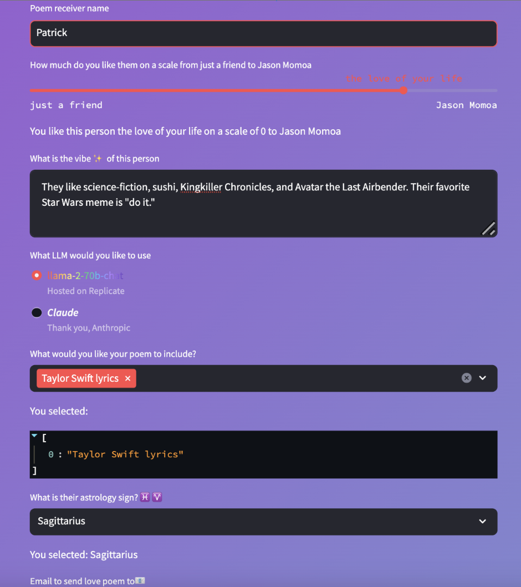

## Generate a Personalized Valentine's Day Poem w/ LLMs!

S/o to S/o [Daniel Kim](https://www.twitter.com/learnwdaniel) for the “just a friend” to Jason Momoa [streamlit](twitter.com/streamlit) slider and general prose edits, [Sarah Chieng](twitter.com/SarahChieng) for the best [Exa AI](https://twitter.com/ExaAILabs) API support🔥, and [Kevin Leffew](https://twitter.com/kleffew94) for the idea

#### Prerequisites
- Twilio SendGrid account to send an email - [make an account here](https://signup.sendgrid.com/) and [make an API key here](https://app.sendgrid.com/settings/api_keys) 
- An email address to test out this project 
- Anthropic account to use their Completions API - [get on the waitlist to use their APIs here](https://www.anthropic.com/earlyaccess) so you can [make your API key here](https://console.anthropic.com/settings/keys) 
- Exa account to crawl the web via an API - [make an account here](https://dashboard.exa.ai/login) and [grab an API key here](https://dashboard.exa.ai/overview)
- Replicate account to use their hosted LlaMA 2 and Stable Diffusion models – [make a Replicate account here](https://replicate.com/signin?next=/) and [grab an API key here](https://replicate.com/account/api-tokens)